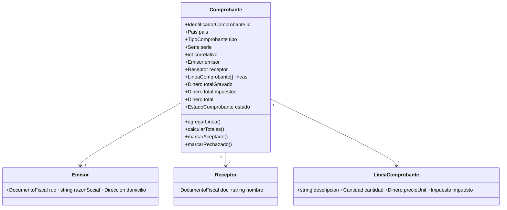
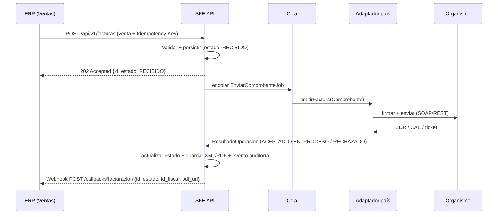

# Arquitectura del Servicio de Facturación Electrónica Multi-País

**Proyecto:** SaaS Tienda Moda — Servicio de Facturación Electrónica (SFE)
**Rol del documento:** Diseño de arquitectura (previo a la implementación)
**Enfoque:** Clean Architecture · Domain-Driven Design · Ports & Adapters (Hexagonal) · Strategy/Adapter por país
**Stack:** PHP 8.2+ / Laravel 10 (dominio agnóstico del framework)
**Última actualización:** Julio 2026

---

## 1. Resumen ejecutivo

El objetivo es dotar al ERP *Tienda Moda* de facturación electrónica **sin acoplar la lógica fiscal de cada país a la lógica de negocio del ERP**. Para ello se diseña un **servicio independiente** (microservicio) llamado **SFE (Servicio de Facturación Electrónica)** que:

1. Expone un **contrato único y estable** al ERP (`EmitirFactura`, `AnularFactura`, `EmitirNotaCredito`, `ConsultarEstado`), idéntico para todos los países.
2. Encapsula la complejidad de cada organismo fiscal (SUNAT en Perú, DIAN en Colombia, SII en Chile, ARCA en Argentina, SAT en México) detrás de **adaptadores intercambiables**.
3. Permite **incorporar un país nuevo creando un adaptador nuevo, sin modificar el código existente** (principio Abierto/Cerrado).

El ERP nunca sabe qué es un XML UBL, un CDR, un CAE o un timbrado. Solo conoce el lenguaje de negocio: "emite una factura para esta venta y avísame cuándo esté aceptada".

### Beneficios

- **Escalabilidad de negocio:** vender el SaaS en varios países reutilizando el mismo ERP.
- **Aislamiento de cambios regulatorios:** cuando SUNAT o el SAT cambian una regla, solo se toca un adaptador.
- **Despliegue y escalado independientes:** el SFE puede escalarse horizontalmente según el volumen de emisión sin tocar el ERP.
- **Testeabilidad:** el dominio es PHP puro; los organismos externos se simulan con dobles de prueba.

---

## 2. Visión general (diagrama de contexto)

```mermaid
flowchart LR
    subgraph ERP["ERP Tienda Moda (Laravel)"]
        V[Módulo Ventas]
        CFE[Cliente SFE\n(SDK HTTP)]
        V --> CFE
    end

    subgraph SFE["Servicio de Facturación Electrónica (SFE)"]
        API[API REST v1]
        UC[Casos de uso\nEmitir / Anular / NC / Estado]
        FAB[Fábrica de proveedores]
        ADP{{Adaptador por país}}
        Q[(Cola de trabajos\n+ reintentos)]
        DB[(BD comprobantes\n+ auditoría)]
        ST[(Almacén XML/PDF)]
        API --> UC --> FAB --> ADP
        UC --> Q
        UC --> DB
        ADP --> ST
    end

    subgraph ORG["Organismos fiscales"]
        SUNAT[(SUNAT · Perú)]
        DIAN[(DIAN · Colombia)]
        SII[(SII · Chile)]
        ARCA[(ARCA · Argentina)]
        SAT[(SAT/PAC · México)]
    end

    CFE -- REST/JSON --> API
    API -- Webhook estado --> CFE
    ADP -- SOAP/REST --> SUNAT
    ADP -- REST --> DIAN
    ADP -- REST/SOAP --> SII
    ADP -- SOAP --> ARCA
    ADP -- REST --> SAT
```

**Idea central:** el ERP habla un solo idioma (REST/JSON de negocio) con el SFE. El SFE traduce ese idioma al dialecto de cada organismo mediante el adaptador correspondiente, elegido en tiempo de ejecución según el país de la empresa emisora.

---

## 3. Principios de diseño

### 3.1 Clean Architecture (regla de dependencia)

Las dependencias apuntan **siempre hacia adentro**. El dominio no conoce Laravel, ni la base de datos, ni SUNAT.

```
┌───────────────────────────────────────────────┐
│ Interfaces (HTTP REST, CLI, Jobs de cola)      │  ← frameworks, entrega
│   ┌───────────────────────────────────────┐    │
│   │ Application (Casos de uso, DTOs)       │    │  ← orquestación
│   │   ┌───────────────────────────────┐    │    │
│   │   │ Domain (Entidades, VO, Puertos)│   │    │  ← reglas de negocio puras
│   │   └───────────────────────────────┘    │    │
│   └───────────────────────────────────────┘    │
│ Infrastructure (Adaptadores país, BD, storage) │  ← detalles, implementaciones
└───────────────────────────────────────────────┘
        Las flechas de dependencia apuntan hacia el Domain.
```

- **Domain**: entidades (`Comprobante`, `Emisor`, `Receptor`), value objects (`Dinero`, `TipoComprobante`, `EstadoComprobante`, `Pais`), **puertos** (interfaces) y excepciones de negocio. PHP puro, sin `use Illuminate\...`.
- **Application**: casos de uso que orquestan el dominio y hablan con los puertos. Reciben *Commands* (DTO de entrada) y devuelven *Results* (DTO de salida).
- **Infrastructure**: implementaciones concretas de los puertos: adaptadores por país, repositorios Eloquent, almacenamiento en disco/S3, clientes SOAP/HTTP.
- **Interfaces**: controladores REST, requests de validación, recursos de respuesta y *jobs* de cola.

### 3.2 Ports & Adapters (Hexagonal)

- **Puerto primario (driving):** el caso de uso, invocado desde HTTP.
- **Puerto secundario (driven):** `ProveedorFacturacion` (la operación fiscal), `ComprobanteRepository`, `AlmacenDocumentos`, `RegistroAuditoria`. El dominio define la interfaz; la infraestructura la implementa.

### 3.3 Strategy / Adapter por país

`ProveedorFacturacion` es la **estrategia**. Cada país es una implementación concreta (adaptador) que envuelve el SDK/SOAP/REST del organismo. Una **fábrica** (`FabricaProveedorFacturacion`) selecciona la estrategia según el `Pais` del emisor.

### 3.4 SOLID aplicado

| Principio | Cómo se aplica |
|-----------|----------------|
| **S** — Responsabilidad única | Cada adaptador solo sabe de su país; cada caso de uso hace una cosa. |
| **O** — Abierto/Cerrado | Agregar país = agregar clase; no se modifica lo existente. |
| **L** — Sustitución de Liskov | Cualquier adaptador es intercambiable tras la interfaz `ProveedorFacturacion`. |
| **I** — Segregación de interfaces | Interfaces pequeñas y enfocadas (facturación, almacenamiento, auditoría separadas). |
| **D** — Inversión de dependencias | Los casos de uso dependen de abstracciones (puertos), no de SUNAT ni de Eloquent. |

---

## 4. La interfaz común (el corazón del diseño)

Todas las operaciones fiscales de cualquier país se expresan con **un solo contrato**:

```php
namespace App\Domain\Facturacion\Contract;

use App\Domain\Facturacion\Model\Comprobante;
use App\Domain\Facturacion\Model\SolicitudAnulacion;
use App\Domain\Facturacion\Model\NotaCredito;
use App\Domain\Facturacion\Model\ResultadoOperacion;
use App\Domain\Facturacion\ValueObject\IdentificadorComprobante;

interface ProveedorFacturacion
{
    /** ¿Este proveedor atiende al país indicado? (usado por la fábrica) */
    public function soporta(\App\Domain\Facturacion\ValueObject\Pais $pais): bool;

    /** Emite una factura/boleta y devuelve el resultado del organismo. */
    public function emitirFactura(Comprobante $comprobante): ResultadoOperacion;

    /** Emite una nota de crédito asociada a un comprobante previo. */
    public function emitirNotaCredito(NotaCredito $notaCredito): ResultadoOperacion;

    /** Anula/da de baja un comprobante ya emitido (comunicación de baja / cancelación). */
    public function anularFactura(SolicitudAnulacion $solicitud): ResultadoOperacion;

    /** Consulta el estado actual del comprobante ante el organismo. */
    public function consultarEstado(IdentificadorComprobante $id): ResultadoOperacion;
}
```

**Puntos clave del contrato:**

- Es **estable**: aunque un país nuevo requiera pasos internos distintos (SUNAT usa CDR síncrono; SUNAT boletas usa *resumen diario* asíncrono con *ticket*; ARCA devuelve CAE inmediato; México timbra vía PAC), todos se normalizan a `ResultadoOperacion`.
- **No filtra detalles de país**: no aparece `XmlUbl`, ni `CAE`, ni `UUID` en la firma. Esos datos viajan dentro de `ResultadoOperacion` en un contenedor genérico (`datosProveedor: array`) y en campos comunes (`estado`, `codigo`, `mensaje`, `identificadorFiscal`).
- Es **asíncrono-amigable**: si el organismo responde "en proceso" (ticket), el resultado trae `estado = EN_PROCESO` y el sistema reintenta la consulta más tarde.

### 4.1 Normalización de estados

Los múltiples estados de cada país se colapsan a un **enum de dominio** común:

```
RECIBIDO      → el SFE aceptó la solicitud, aún no enviada al organismo
EN_PROCESO    → enviada; el organismo responde de forma diferida (ticket/lote)
ACEPTADO      → el organismo la aceptó (CDR OK / CAE / UUID timbrado / CUFE validado)
OBSERVADO     → aceptada con observaciones/advertencias no bloqueantes
RECHAZADO     → el organismo la rechazó (errores fiscales); requiere corrección
ANULADO       → dada de baja/cancelada correctamente
ERROR         → fallo técnico (comunicación, firma, certificado) → reintentable
```

Cada adaptador implementa un **mapeador** de los códigos del organismo a este enum (p. ej. `MapeadorCdrSunat`, `MapeadorRespuestaArca`).

---

## 5. Cómo agregar un país nuevo SIN modificar el código existente

Este es el requisito central. El procedimiento es puramente **aditivo**:

1. **Crear el adaptador**: `app/Infrastructure/Proveedor/{Pais}/{Organismo}Proveedor.php` implementando `ProveedorFacturacion`.
2. **Crear sus colaboradores** dentro de la misma carpeta (builder de XML/JSON, firmador, cliente HTTP/SOAP, mapeador de estados). Nada de esto sale de `Infrastructure/Proveedor/{Pais}/`.
3. **Registrarlo** en la configuración `config/facturacion.php` (mapa `pais → clase`) **o** etiquetarlo con un atributo/`tag` de contenedor. La fábrica lo descubre automáticamente.
4. **Agregar sus credenciales/catálogos** (certificados, endpoints, catálogos de tipos de documento) como *configuración/datos*, no como código de negocio.

```php
// config/facturacion.php  — ÚNICO punto que se "amplía" (no se modifica lógica)
'proveedores' => [
    'PE' => App\Infrastructure\Proveedor\Peru\SunatProveedor::class,
    'CO' => App\Infrastructure\Proveedor\Colombia\DianProveedor::class,
    'CL' => App\Infrastructure\Proveedor\Chile\SiiProveedor::class,
    'AR' => App\Infrastructure\Proveedor\Argentina\ArcaProveedor::class,
    'MX' => App\Infrastructure\Proveedor\Mexico\SatProveedor::class,
    // 'EC' => App\Infrastructure\Proveedor\Ecuador\SriProveedor::class,  ← país nuevo: solo se añade esta línea
],
```

> **No se toca** ningún caso de uso, ni el controlador, ni los adaptadores existentes. Cumple Abierto/Cerrado. Añadir Ecuador es: 1 carpeta nueva + 1 línea de config.

La fábrica resuelve el adaptador en tiempo de ejecución:

```php
final class FabricaProveedorFacturacion
{
    public function __construct(private ContenedorServicios $container, private array $mapa) {}

    public function para(Pais $pais): ProveedorFacturacion
    {
        $clase = $this->mapa[$pais->codigoIso()] ?? null;
        if ($clase === null) {
            throw new ProveedorNoSoportadoException($pais);
        }
        return $this->container->make($clase); // inyección de dependencias resuelve colaboradores
    }
}
```

---

## 6. Modelo de dominio

### 6.1 Agregado principal: `Comprobante`

El agregado raíz es `Comprobante`. Encapsula las invariantes de un documento tributario **independientes del país** (un comprobante tiene un emisor, un receptor, al menos una línea, totales coherentes, una moneda, un tipo).



### 6.2 Value Objects (inmutables, auto-validados)

- `Pais` (ISO-3166 alpha-2: PE, CO, CL, AR, MX).
- `TipoComprobante` (FACTURA, BOLETA, NOTA_CREDITO, NOTA_DEBITO) → cada adaptador lo mapea a su código local (SUNAT `01`/`03`, CFDI `I`, etc.).
- `Dinero` (monto + `Moneda`, aritmética segura, sin floats).
- `DocumentoFiscal` (RUC/NIT/RUT/CUIT/RFC — validación de formato por país mediante estrategia de validación).
- `EstadoComprobante` (enum del §4.1).
- `Serie` / `IdentificadorComprobante`.

> **Regla:** el dominio valida lo **universal** (totales cuadran, cantidades positivas, moneda válida). Lo **específico de país** (formato de RUC, catálogos SUNAT, régimen fiscal del SAT) lo valida el **adaptador** antes de enviar.

---

## 7. Estructura de carpetas

```
servicio-facturacion/
├── app/
│   ├── Domain/                         # ← PHP puro, sin framework
│   │   └── Facturacion/
│   │       ├── Model/                  # Entidades y agregados
│   │       │   ├── Comprobante.php
│   │       │   ├── LineaComprobante.php
│   │       │   ├── Emisor.php
│   │       │   ├── Receptor.php
│   │       │   ├── NotaCredito.php
│   │       │   ├── SolicitudAnulacion.php
│   │       │   └── ResultadoOperacion.php
│   │       ├── ValueObject/
│   │       │   ├── Pais.php
│   │       │   ├── TipoComprobante.php
│   │       │   ├── EstadoComprobante.php
│   │       │   ├── Dinero.php
│   │       │   ├── Moneda.php
│   │       │   ├── DocumentoFiscal.php
│   │       │   └── IdentificadorComprobante.php
│   │       ├── Contract/               # PUERTOS (interfaces)
│   │       │   ├── ProveedorFacturacion.php
│   │       │   ├── ComprobanteRepository.php
│   │       │   ├── AlmacenDocumentos.php
│   │       │   └── RegistroAuditoria.php
│   │       └── Exception/
│   │           ├── FacturacionException.php
│   │           ├── ProveedorNoSoportadoException.php
│   │           ├── ComprobanteInvalidoException.php
│   │           └── RechazoOrganismoException.php
│   ├── Application/
│   │   └── Facturacion/
│   │       ├── UseCase/
│   │       │   ├── EmitirFactura.php
│   │       │   ├── EmitirNotaCredito.php
│   │       │   ├── AnularFactura.php
│   │       │   └── ConsultarEstado.php
│   │       ├── DTO/
│   │       │   ├── EmitirFacturaCommand.php
│   │       │   ├── EmitirNotaCreditoCommand.php
│   │       │   ├── AnularFacturaCommand.php
│   │       │   ├── ConsultarEstadoQuery.php
│   │       │   └── ResultadoEmisionDTO.php
│   │       └── Contract/
│   │           └── FabricaProveedor.php
│   ├── Infrastructure/
│   │   ├── Proveedor/
│   │   │   ├── FabricaProveedorFacturacion.php
│   │   │   ├── Peru/                    # ← adaptador de REFERENCIA (completo)
│   │   │   │   ├── SunatProveedor.php
│   │   │   │   ├── ConstructorUbl21.php
│   │   │   │   ├── FirmadorXmlSunat.php
│   │   │   │   ├── ClienteSoapSunat.php
│   │   │   │   └── MapeadorCdrSunat.php
│   │   │   ├── Colombia/  DianProveedor.php        (stub)
│   │   │   ├── Chile/     SiiProveedor.php         (stub)
│   │   │   ├── Argentina/ ArcaProveedor.php        (stub)
│   │   │   └── Mexico/    SatProveedor.php         (stub)
│   │   ├── Persistence/Eloquent/
│   │   │   ├── Models/ComprobanteEloquent.php
│   │   │   └── ComprobanteRepositoryEloquent.php
│   │   ├── Almacenamiento/
│   │   │   └── AlmacenDocumentosDisco.php
│   │   └── Auditoria/
│   │       └── RegistroAuditoriaBd.php
│   ├── Http/
│   │   ├── Controllers/Api/V1/
│   │   │   ├── FacturaController.php
│   │   │   ├── NotaCreditoController.php
│   │   │   └── EstadoController.php
│   │   ├── Requests/
│   │   │   └── EmitirFacturaRequest.php
│   │   └── Resources/
│   │       └── ResultadoResource.php
│   ├── Jobs/
│   │   ├── EnviarComprobanteJob.php
│   │   └── SincronizarEstadoJob.php
│   └── Providers/
│       └── FacturacionServiceProvider.php
├── config/
│   └── facturacion.php
├── database/
│   └── migrations/
│       ├── 2026_07_01_000001_create_comprobantes_table.php
│       ├── 2026_07_01_000002_create_comprobante_lineas_table.php
│       ├── 2026_07_01_000003_create_facturacion_eventos_table.php
│       └── 2026_07_01_000004_create_credenciales_pais_table.php
├── routes/
│   └── api.php
└── README.md
```

---

## 8. Modelo de datos

Tablas principales del SFE (independientes de la BD del ERP):

### `comprobantes`
| Columna | Tipo | Notas |
|---------|------|-------|
| id | uuid (PK) | id interno del SFE |
| empresa_id | uuid | tenant emisor (multi-empresa) |
| pais | char(2) | PE, CO, CL, AR, MX |
| tipo | varchar | FACTURA, BOLETA, NOTA_CREDITO... |
| serie | varchar | serie fiscal |
| correlativo | bigint | número |
| moneda | char(3) | PEN, COP, CLP, ARS, MXN, USD |
| total | decimal(14,2) | total del documento |
| estado | varchar | enum de dominio (§4.1) |
| id_fiscal | varchar | CDR/CAE/UUID/CUFE devuelto por el organismo |
| referencia_externa | varchar | id de la venta en el ERP (**idempotencia**) |
| hash | varchar | huella del documento firmado |
| creado_en / actualizado_en | timestamp | |

- **Índice único** `(empresa_id, referencia_externa)` → garantiza **idempotencia**: reintentar la misma venta no crea dos comprobantes.
- **Índice único** `(empresa_id, pais, serie, correlativo)` → no duplica numeración.

### `comprobante_lineas`
Detalle (producto, cantidad, precio, impuesto, subtotal) referenciando `comprobante_id`.

### `facturacion_eventos` (auditoría inmutable)
| id | comprobante_id | tipo_evento | estado_anterior | estado_nuevo | payload_envio | payload_respuesta | actor | ip | creado_en |

Registro **append-only** (nunca se actualiza ni borra) de cada interacción con el organismo. Es la fuente de verdad para auditoría y disputas.

### `credenciales_pais`
Certificados digitales, usuario SOL/clave (SUNAT), tokens de PAC (México), certificado + CAF (Chile), por `empresa_id` + `pais`. **Cifradas en reposo**; nunca en logs.

---

## 9. Comunicación ERP ↔ SFE

Se adopta un **modelo híbrido** (REST síncrono para la orden + asincronía interna + webhook para el resultado final). Es el patrón más robusto para organismos que responden de forma diferida.

### 9.1 Flujo recomendado



- **`202 Accepted` inmediato**: el ERP no queda bloqueado esperando a SUNAT. Recibe un `id` y el estado `RECIBIDO`.
- **Webhook** cuando el estado es definitivo (`ACEPTADO`/`RECHAZADO`/`ANULADO`). El ERP también puede **consultar por *polling*** `GET /api/v1/comprobantes/{id}`.
- **Modo síncrono opcional**: para POS que exigen el número fiscal al instante (p. ej. facturas SUNAT con CDR inmediato), el endpoint acepta `?modo=sincrono` y espera el resultado (con *timeout*). Boletas SUNAT (resumen diario) siempre serán asíncronas.

### 9.2 Contrato de API (REST v1)

| Método | Ruta | Operación |
|--------|------|-----------|
| `POST` | `/api/v1/facturas` | Emitir factura/boleta |
| `POST` | `/api/v1/notas-credito` | Emitir nota de crédito |
| `POST` | `/api/v1/comprobantes/{id}/anular` | Anular / comunicación de baja |
| `GET`  | `/api/v1/comprobantes/{id}` | Consultar estado |
| `GET`  | `/api/v1/comprobantes/{id}/xml` | Descargar XML firmado |
| `GET`  | `/api/v1/comprobantes/{id}/pdf` | Descargar representación impresa (PDF) |

**Ejemplo de solicitud de emisión** (lenguaje de negocio, sin detalles de país):

```json
POST /api/v1/facturas
Idempotency-Key: venta-8842-tienda-12
Authorization: Bearer <token-empresa>
{
  "pais": "PE",
  "tipo": "FACTURA",
  "moneda": "PEN",
  "emisor":   { "documento": "20512345678", "razon_social": "Moda Demo SAC" },
  "receptor": { "tipo_doc": "RUC", "documento": "20456789012", "nombre": "Cliente SAC" },
  "referencia_externa": "8842",
  "lineas": [
    { "descripcion": "Polo algodón", "cantidad": 2, "precio_unitario": 50.00, "tasa_impuesto": 0.18 }
  ]
}
```

**Respuesta:**
```json
HTTP/1.1 202 Accepted
{ "id": "9f1c...", "estado": "RECIBIDO", "consultar_en": "/api/v1/comprobantes/9f1c..." }
```

### 9.3 ¿REST o mensajería?

- **ERP ↔ SFE**: **REST** (simple, síncrono para la orden) + **webhooks** para el resultado. Es lo más sencillo de operar en la etapa actual.
- **Dentro del SFE**: **mensajería/colas** (Redis/RabbitMQ vía Laravel Queues) para el envío al organismo, reintentos y consultas de ticket. Esto desacopla la latencia del organismo del ciclo de request del ERP.
- **Evolución futura**: si crece el volumen o se integran más sistemas (contabilidad, e-commerce), se puede publicar eventos de dominio (`ComprobanteAceptado`, `ComprobanteRechazado`) a un *bus* (Kafka/RabbitMQ) manteniendo el mismo dominio.

---

## 10. Manejo de errores

Taxonomía de errores en cuatro categorías, cada una con tratamiento distinto:

| Categoría | Ejemplo | Estado resultante | Acción |
|-----------|---------|-------------------|--------|
| **Validación (entrada)** | falta RUC, total no cuadra | `422` (no se crea comprobante) | El ERP corrige y reintenta. |
| **Negocio/fiscal (rechazo del organismo)** | RUC no habido, serie no autorizada, error de catálogo | `RECHAZADO` | No reintentar automático; requiere corrección. Se notifica al ERP. |
| **Comunicación/técnico** | *timeout*, 500 del organismo, certificado caído | `ERROR` | **Reintento automático** con *backoff* (§11). |
| **Observación** | aceptado con advertencia | `OBSERVADO` | Se acepta; se registra la advertencia. |

- Todos los errores se normalizan a una `FacturacionException` con `codigo`, `mensaje`, `categoria` y `detalleProveedor`.
- El **código del organismo** (p. ej. SUNAT `2335`, ARCA `10016`) se conserva en la auditoría, pero **no** se propaga crudo al ERP: se traduce a un código estable del SFE.

---

## 11. Reintentos, idempotencia y consistencia

### 11.1 Reintentos con *backoff* exponencial

`EnviarComprobanteJob` (cola) reintenta ante errores **técnicos** (categoría *comunicación*), nunca ante rechazos fiscales:

```
intento 1 → inmediato
intento 2 → +30 s
intento 3 → +2 min
intento 4 → +10 min
intento 5 → +1 h
> 5      → estado ERROR persistente + alerta a operaciones (dead-letter)
```

- **Circuit breaker** por país: si SUNAT está caído, se abre el circuito y se pausan los envíos a Perú (se siguen aceptando solicitudes con estado `RECIBIDO`) para no saturar.
- **Idempotencia hacia el organismo**: antes de reenviar se **consulta el estado** (`consultarEstado`) para no duplicar si el envío anterior sí llegó.

### 11.2 Idempotencia hacia el ERP

- Cabecera **`Idempotency-Key`** obligatoria (usualmente el id de la venta). El índice único `(empresa_id, referencia_externa)` hace que una segunda llamada devuelva el **mismo** comprobante en vez de crear otro.

### 11.3 Patrón *Outbox* (consistencia)

La creación del comprobante y el encolado del envío ocurren en **una transacción** (registro en tabla `outbox`), y un *worker* publica desde el outbox. Así nunca se pierde un envío por una caída entre "guardé en BD" y "encolé el job".

---

## 12. Auditoría

- **Log de eventos inmutable** (`facturacion_eventos`, *append-only*): cada transición de estado y cada request/response con el organismo queda registrado con `payload_envio`, `payload_respuesta`, `actor`, `ip`, `timestamp`.
- **Trazabilidad completa**: dado un comprobante se puede reconstruir toda su historia (quién lo emitió, cuándo se envió, qué respondió SUNAT, cuándo se anuló).
- **No repudio**: se guarda el **hash** del XML firmado y el certificado usado.
- **Retención legal**: la auditoría y los documentos se conservan según cada país (p. ej. Perú exige conservar los CPE; varios países exigen 5 años o más).

---

## 13. Almacenamiento de XML / PDF

- **Puerto `AlmacenDocumentos`** desacopla el destino (disco local, S3, GCS).
- **Convención de rutas** (multi-tenant, particionada por fecha):
  ```
  {empresa_id}/{pais}/{año}/{mes}/{tipo}-{serie}-{correlativo}/
        ├── firmado.xml         (XML/UBL/DTE/CFDI firmado)
        ├── respuesta.xml        (CDR / acuse / timbre del organismo)
        └── representacion.pdf    (PDF imprimible / ticket)
  ```
- **Versionado e inmutabilidad**: los documentos aceptados no se sobrescriben; una corrección genera un documento nuevo (nota de crédito), nunca edita el original.
- **Cifrado en reposo** y URLs firmadas de descarga con expiración.
- **Retención** configurable por país; *lifecycle* a almacenamiento frío para documentos antiguos.

---

## 14. Especificidades por país (tabla comparativa)

| País | Organismo | Formato | Firma | Transporte | Respuesta | Anulación | Nota de crédito |
|------|-----------|---------|-------|-----------|-----------|-----------|-----------------|
| **Perú** | SUNAT (o vía **OSE/PSE**) | **UBL 2.1** (CPE) | XML-DSig (cert. digital) | SOAP (envío) / REST (OSE) | **CDR** (síncrono factura) / **ticket** (resumen diario boletas) | **Comunicación de baja** | Tipo `07` |
| **Colombia** | **DIAN** | **UBL 2.1** (perfil DIAN) | XML-DSig + **CUFE** | REST (validación previa) | Aceptación con **CUFE** | Nota de ajuste / evento | Nota crédito UBL |
| **Chile** | **SII** | **DTE** (XML propio) | XML-DSig + **CAF** (folios) | SOAP/REST (envío + set de pruebas) | Acuse/estado de envío | Anula vía nota de crédito | DTE tipo 61 |
| **Argentina** | **ARCA** (ex-AFIP) | Sin XML propio (datos) | Token WSAA | **SOAP** (`WSFEv1`) | **CAE/CAEA** inmediato | Nota de crédito (comprobante) | Comprobante NC (tipos 3/8/13) |
| **México** | **SAT** vía **PAC** | **CFDI 4.0** (XML) | Sello CSD + **timbrado PAC** → **UUID** | REST (al PAC) | **UUID** (timbre fiscal) | **Cancelación** (con acuse/aceptación) | CFDI Egreso |

**Implicaciones para el diseño:**

- El contrato común absorbe estas diferencias porque expone `estado` normalizado y `ResultadoOperacion.datosProveedor` (CDR, CAE, UUID, CUFE viven ahí).
- **Asincronía**: Perú-boletas y colas de organismos exigen soportar `EN_PROCESO` + consulta diferida (ticket). El diseño ya lo contempla en el §9 y §11.
- **Argentina** no maneja "XML del contribuyente": el adaptador ARCA construye la representación PDF a partir del CAE. El puerto `AlmacenDocumentos` guarda PDF aunque no haya XML firmado propio.
- **México** introduce un tercero (**PAC**): el `SatProveedor` es un adaptador sobre el PAC, no sobre el SAT directamente.

---

## 15. Seguridad

- **Certificados por empresa/país** cifrados en reposo (`credenciales_pais`), cargados en memoria solo durante la firma.
- **Aislamiento multi-tenant**: toda consulta filtra por `empresa_id`; un tenant nunca ve comprobantes de otro.
- **Autenticación ERP → SFE**: token por empresa (OAuth2 client-credentials / API key con rotación). Opcional **mTLS** entre ERP y SFE.
- **Secretos** en un gestor (Vault / AWS Secrets Manager), nunca en el repositorio ni en logs.
- **Webhooks firmados** (HMAC) para que el ERP verifique la autenticidad del callback.

---

## 16. Observabilidad

- **Logs estructurados** (JSON) con `correlation-id` que enlaza ERP → SFE → organismo.
- **Métricas**: emisiones/min, tasa de aceptación, latencia por organismo, tamaño de cola, reintentos, circuito abierto/cerrado.
- **Health checks** por país (`/health/pe`, `/health/mx`) que verifican conectividad con cada organismo.
- **Alertas**: rechazos por encima de umbral, dead-letter no vacío, certificado próximo a expirar.

---

## 17. Hoja de ruta por fases

### Fase 0 — Fundaciones (2–3 semanas)
- Esqueleto del SFE (Clean Architecture + DDD), dominio y puertos, contrato común `ProveedorFacturacion`.
- API REST v1, persistencia, colas, auditoría, almacenamiento, patrón outbox e idempotencia.
- SDK cliente en el ERP (`Cliente SFE`) y contrato de webhook.
- **Entregable:** servicio que acepta solicitudes, persiste, encola y responde `202` — con un **adaptador *fake*** que simula aceptación (permite integrar el ERP end-to-end sin organismo real).

### Fase 1 — Perú / SUNAT (MVP productivo) (3–5 semanas)
- Adaptador SUNAT completo: UBL 2.1, firma XML-DSig, envío SOAP, CDR, **boletas por resumen diario** (ticket asíncrono), **comunicación de baja**, **nota de crédito**.
- Homologación en el entorno **beta de SUNAT**; generación de PDF.
- **Entregable:** una tienda peruana factura de verdad. Es el país de referencia del patrón.

### Fase 2 — Endurecimiento (2–3 semanas)
- Reintentos + *backoff* + circuit breaker + dead-letter, observabilidad, alertas de certificado.
- Pruebas de carga, *chaos testing* de caídas de organismo, panel de estado de comprobantes.

### Fase 3 — Colombia / DIAN (3–4 semanas)
- Adaptador DIAN (UBL 2.1 perfil DIAN, CUFE, validación previa). **Cero cambios** en dominio/casos de uso: solo carpeta `Colombia/` + 1 línea de config.
- Valida que el patrón "agregar país sin tocar lo existente" funciona en la práctica.

### Fase 4 — Chile (SII), México (SAT/PAC), Argentina (ARCA) (paralelizable, 3–4 semanas c/u)
- Chile: DTE, CAF/folios, set de pruebas SII.
- México: integración con un **PAC** (CFDI 4.0, timbrado, cancelación con aceptación).
- Argentina: **SOAP WSFEv1**, WSAA (token), CAE, PDF a partir del CAE.

### Fase 5 — Escala y multi-organismo (continuo)
- Soporte OSE/PSE alternativos en Perú, multi-PAC en México (failover), *bus* de eventos de dominio, tablero de conciliación fiscal, nuevos países (Ecuador/SRI, etc.) como pura extensión.

---

## 18. Decisiones de arquitectura (ADR resumidas)

| # | Decisión | Motivo |
|---|----------|--------|
| ADR-1 | Servicio **independiente** (no un módulo del ERP) | Escalado y despliegue separados; aislar riesgo fiscal. |
| ADR-2 | **Strategy/Adapter** por país tras interfaz única | Agregar país sin modificar código (Abierto/Cerrado). |
| ADR-3 | **Dominio agnóstico del framework** (PHP puro) | Testeabilidad y longevidad frente a cambios de Laravel. |
| ADR-4 | **REST + webhook** ERP↔SFE; **colas** dentro del SFE | Desacoplar la latencia de los organismos del POS. |
| ADR-5 | **Idempotencia** por `referencia_externa` + `Idempotency-Key` | Evitar duplicar comprobantes ante reintentos. |
| ADR-6 | **Estados normalizados** + `datosProveedor` genérico | Un contrato estable pese a formatos país muy distintos. |
| ADR-7 | **Auditoría inmutable** (append-only) | Cumplimiento legal y no repudio. |
| ADR-8 | **Perú como país de referencia** (Fase 1) | Es donde opera hoy el negocio; valida el patrón. |

---

## 19. Cómo se conecta con el ERP Tienda Moda

En el ERP, el módulo de Ventas **no cambia su lógica**. Tras registrar la venta, publica una intención de facturar:

```php
// En el ERP (Laravel) — VentaController@store, tras DB::commit()
$this->clienteSfe->emitirFactura(
    ClienteSfe\EmitirFacturaRequest::desdeVenta($venta, $tienda->pais)
);
// El ERP solo guarda el 'comprobante_id' devuelto y espera el webhook para
// actualizar la venta a 'facturada' con su número fiscal.
```

- El ERP añade una tabla de enlace `venta_comprobante` (venta_id ↔ comprobante_id ↔ estado) y una ruta de **webhook** `/callbacks/facturacion`.
- Si el SFE aún no soporta el país de la tienda, devuelve `ProveedorNoSoportado` y el ERP registra la venta como "pendiente de facturar" sin romper el flujo de caja.

---

*Fin del documento de arquitectura. El scaffolding de código correspondiente (interfaces, entidades, casos de uso, adaptador Perú de referencia y stubs de los demás países) se entrega en la carpeta `servicio-facturacion/`.*
